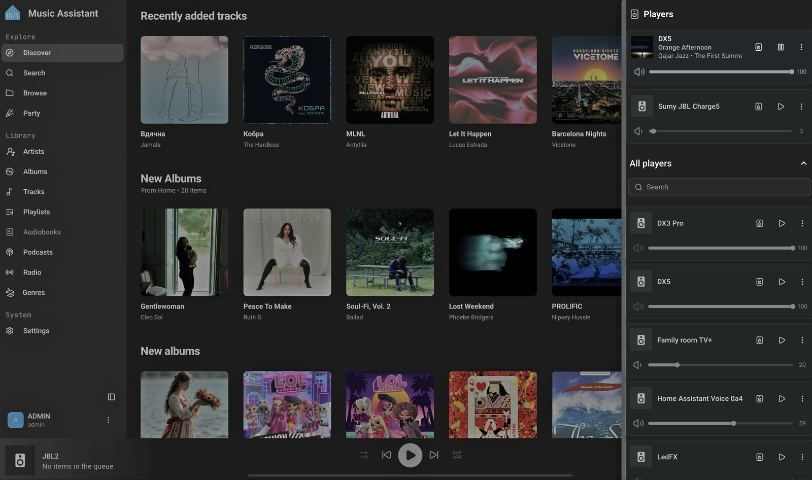
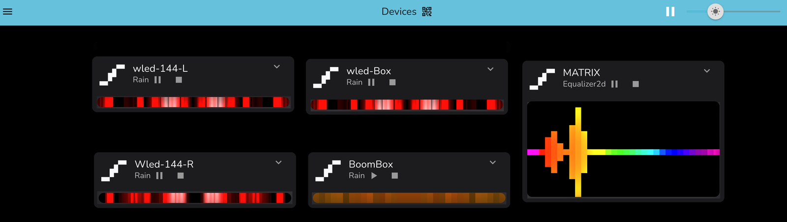
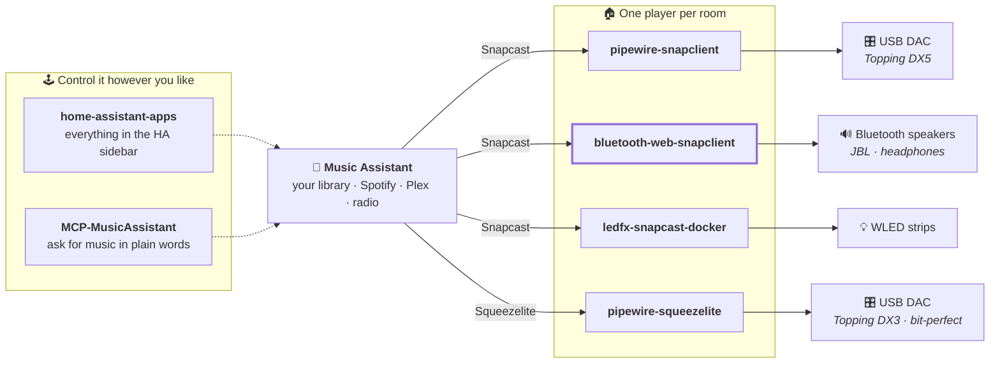

<h1 align="center">🎶 Home Audio Stack</h1>

<p align="center">
  <b>Hi-Fi sound in every room — built from gear you already own.</b><br>
  One music app. Any speaker. Perfect sync. No subscription, no lock-in.
</p>

<p align="center">
  <a href="#-the-problem">The problem</a> ·
  <a href="#-what-you-get">What you get</a> ·
  <a href="#-the-parts">The parts</a> ·
  <a href="#-how-it-fits-together">How it fits</a> ·
  <a href="#-getting-started">Get started</a>
</p>

<p align="center">
  
  <br><sub>One app, every room — a USB DAC, a Bluetooth speaker, a second DAC, the TV, and the LED strips.<br>All of them built from the projects below.</sub>
</p>

---

## 🤔 The problem

You want good sound in the whole house. The usual answer is to buy a set of
matching wireless speakers — and it works, but it is expensive, it locks you into
one brand, and the box you already have sitting on the shelf is not invited.

Meanwhile you probably already own:

- a **USB DAC** or an amplifier that sounds great
- a **Bluetooth speaker** or two, and some headphones
- an old **laptop, mini-PC or Raspberry Pi** doing nothing
- maybe some **LED strips**

And you already have the music: your own collection, plus Spotify, Plex, YouTube
Music or internet radio.

What is missing is the part in the middle — something that takes all of it and
makes it behave like one system, **in sync**, at **full quality**, controlled from
**one place**.

That is what this is.

## ✨ What you get

|  | |
| :-- | :-- |
| 🎛️ **One app for everything** | [Music Assistant](https://www.music-assistant.io/) is the brain: your own library plus Spotify, Plex, radio and more, all in one interface, inside Home Assistant. |
| 🏠 **Every room in sync** | Press play once and the kitchen, living room and bathroom stay together — no echo walking between rooms. |
| 🎧 **Real Hi-Fi, not "good enough"** | Audio reaches your DAC untouched, at the track's own quality. A 96 kHz/24-bit file plays as 96 kHz/24-bit. |
| 🔊 **Use the speakers you own** | Bluetooth speakers and headphones join as rooms, pair from a web page, several at once. |
| 💡 **Lights that dance** | LED strips react to whatever is playing. |
| 🗣️ **Just ask** | "Play something relaxing in the kitchen" — an LLM agent can drive it. |
| 💸 **Cheap and yours** | Old hardware, free software, runs on your network. Nothing leaves the house, nothing expires. |

## 🧩 The parts

Each piece is its own project. Take only the ones you need — they work alone, and
they work better together.

### 🔈 Multiroom — [pipewire-snapclient](https://github.com/shuricksumy/pipewire-snapclient)

**What it is:** turns any Linux box with a sound output into a synchronised
speaker for the whole system.

**Why you want it:** this is what makes multiroom *multiroom*. Every player gets
the same audio on the same clock, so five rooms sound like one. Walk from the
kitchen to the hall and the song follows you without a stutter or an echo. Add a
room by starting one more container.

### 🎯 Bit-perfect playback — [pipewire-squeezelite](https://github.com/shuricksumy/pipewire-squeezelite)

**What it is:** a player that hands audio to your DAC exactly as it was recorded.
Music Assistant drives it directly through its Squeezelite provider, so it shows
up as just another room.

**Why you want it:** cheap setups quietly convert everything to one format —
usually 48 kHz — which is why an expensive DAC can sound ordinary. This does not.
A 44.1 kHz CD rip plays at 44.1 kHz, a 96 kHz/24-bit album plays at 96 kHz/24-bit,
and the DAC switches by itself, track to track, up to 384 kHz and DSD. No
resampling, no volume being mangled in software. You hear the file.

### 🔊 Bluetooth speakers — [bluetooth-web-snapclient](https://github.com/shuricksumy/bluetooth-web-snapclient)

**What it is:** a web page to pair Bluetooth speakers and turn them into players.

**Why you want it:** your JBL, your headphones, that portable speaker in the
bathroom — they all become rooms in the same system. Pair them from a browser
instead of the command line, use several at the same time, and take one to the
garden without reconfiguring anything. When a speaker comes back on, its player
reconnects by itself.

<p align="center">
  
  <br><sub>Pair a speaker, and it becomes a room — with what is playing, volume and controls.</sub>
</p>

### 💡 Light show — [ledfx-snapcast-docker](https://github.com/shuricksumy/ledfx-snapcast-docker)

**What it is:** the same audio, turned into real-time effects on WLED strips.

**Why you want it:** the room becomes the party. The lights follow the beat of
whatever is playing anywhere in the house — no microphone, no sound card, no
wiring tricks on the host.

<p align="center">
  
  <br><sub>Five strips, each with its own effect, all following the same music.</sub>
</p>

### 🏠 In Home Assistant — [home-assistant-apps](https://github.com/shuricksumy/home-assistant-apps)

**What it is:** add-ons that put these tools into your Home Assistant sidebar,
even when they run on a different machine.

**Why you want it:** one browser tab for the house. Home Assistant's login
protects them, and they work from outside over Nabu Casa like anything else.

### 🗣️ Ask for music — [MCP-MusicAssistant](https://github.com/shuricksumy/MCP-MusicAssistant)

**What it is:** a bridge that lets an LLM agent control Music Assistant.

**Why you want it:** "put on something calm in the kitchen and move it to the
living room when I get there" — in a sentence, not five clicks.

## 🔗 How it fits together



## 🚀 Getting started

**You need one Linux machine** with your DAC or Bluetooth adapter attached — a
mini-PC, an old laptop or a Raspberry Pi is plenty. Home Assistant and Music
Assistant can live on it too, or somewhere else on the network.

Pick your starting point:

| I want to… | Start with |
| :-- | :-- |
| play to a USB DAC, in sync with other rooms | [pipewire-snapclient](https://github.com/shuricksumy/pipewire-snapclient) |
| use my Bluetooth speaker or headphones as a room | [bluetooth-web-snapclient](https://github.com/shuricksumy/bluetooth-web-snapclient) |
| get the absolute best quality out of my DAC | [pipewire-squeezelite](https://github.com/shuricksumy/pipewire-squeezelite) |
| make the lights dance | [ledfx-snapcast-docker](https://github.com/shuricksumy/ledfx-snapcast-docker) |
| see it all inside Home Assistant | [home-assistant-apps](https://github.com/shuricksumy/home-assistant-apps) |

<details>
<summary><b>A working example: two rooms on one host</b> (click to expand)</summary>

```yaml
services:
  # The brain. Its built-in Snapserver listens on 1704 (audio),
  # 1705 (control) and 1780 (Snapweb).
  music-assistant-server:
    image: ghcr.io/music-assistant/server:latest
    network_mode: host
    volumes: [ ./ma-data:/data ]
    restart: unless-stopped

  # A wired room: straight into the host's PipeWire session.
  snapclient-dx3:
    image: ghcr.io/shuricksumy/snapcast-pipewire:latest
    network_mode: host
    environment:
      - ROLE=snapclient
      - SERVER_IP=192.168.1.50
      - CLIENT_ID=Living Room
      - PIPEWIRE_NODE=alsa_output.usb-Topping_DX3_Pro-00.analog-stereo
      - USE_ALSA=true
    volumes:
      - /run/user/1000/pipewire-0:/tmp/pipewire-0
      - /dev/shm:/dev/shm
    restart: unless-stopped

  # Bluetooth rooms: pair from the browser at http://<host>:8088
  bluetooth-web:
    image: ghcr.io/shuricksumy/bluetooth-web-snapclient:latest
    ports: [ "8088:8080" ]
    security_opt: [ apparmor=unconfined ]   # Ubuntu hosts only
    volumes:
      - /run/dbus/system_bus_socket:/run/dbus/system_bus_socket
      - /run/user/1000/pipewire-0:/tmp/pipewire-0
      - /dev/shm:/dev/shm
      - ./bluetooth-web-config:/config
    environment:
      - SNAPSERVER_HOST=192.168.1.50
      - ADMIN_PASSWORD=changeme
    restart: unless-stopped
```

The host must be a working PipeWire machine first — every player attaches to the
host's audio session instead of running its own.
[The host setup](https://github.com/shuricksumy/pipewire-snapclient#-host-setup-preparation)
is written once and applies to all of them.

</details>

## 💡 Things worth knowing before you start

- **Bluetooth speakers arrive slightly late.** Bluetooth itself adds about a
  quarter of a second. If a Bluetooth room plays alongside a wired one, set a
  negative latency offset for it, and tune by ear until they line up.
- **A Bluetooth speaker that is off does not exist.** Its audio output only
  appears while it is connected, which is why the Bluetooth panel connects the
  speaker first and keeps watching it.
- **On Ubuntu, add `security_opt: [apparmor=unconfined]`** to the Bluetooth
  container. Ubuntu's security policy blocks containers from talking to the
  system's Bluetooth service, and the failure is not obvious.
- **Old hardware is fine.** These are small containers; a Raspberry Pi 4 runs a
  room comfortably.

---

<p align="center"><sub>MIT, like everything it links to · built because the last 10% was always missing</sub></p>
