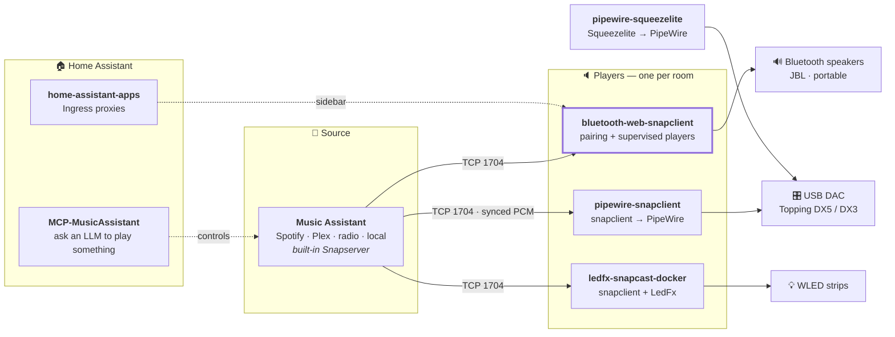

<h1 align="center">Home Audio Stack</h1>

<p align="center">
  How the pieces fit together: <b>Music Assistant</b> as the brain,
  <b>Snapcast</b> for sync, <b>PipeWire</b> for bit-perfect output —
  into USB DACs, Bluetooth speakers and an LED visualiser.
</p>

<p align="center">
  <i>This repo is a map, not code. Each box below is its own project.</i>
</p>

---

## The chain



## The pieces

| Project | What it solves |
| :-- | :-- |
| **[pipewire-snapclient](https://github.com/shuricksumy/pipewire-snapclient)** | Snapcast client *and* server in one image, built against PipeWire so a 44.1 kHz track stays 44.1 kHz all the way to the DAC. The workhorse of the setup. |
| **[bluetooth-web-snapclient](https://github.com/shuricksumy/bluetooth-web-snapclient)** | Pair a Bluetooth speaker from a browser, then run a supervised Snapcast player on it. Closes the gap where a `bluez_output.*` sink only exists while the speaker is connected. |
| **[pipewire-squeezelite](https://github.com/shuricksumy/pipewire-squeezelite)** | Squeezelite on native PipeWire rather than an ALSA loopback — for Lyrion/LMS sources, up to 384 kHz and DSD. |
| **[ledfx-snapcast-docker](https://github.com/shuricksumy/ledfx-snapcast-docker)** | Snapcast, Squeezelite and LedFx in one image, so the WLED strips react to whatever the house is playing. |
| **[home-assistant-apps](https://github.com/shuricksumy/home-assistant-apps)** | Home Assistant add-ons that put services running on *other* hardware back in the sidebar through Ingress — including the Bluetooth panel above. |
| **[MCP-MusicAssistant](https://github.com/shuricksumy/MCP-MusicAssistant)** | An MCP server for Music Assistant, so an LLM agent can play, search, queue and move audio between rooms in plain language. |

## Where to start

**"I have a USB DAC on a spare Linux box and want it synced with the house."**
→ [pipewire-snapclient](https://github.com/shuricksumy/pipewire-snapclient). Add the
Snapcast provider in Music Assistant, point the container at it, done.

**"I want to play to a Bluetooth speaker."**
→ [bluetooth-web-snapclient](https://github.com/shuricksumy/bluetooth-web-snapclient).
Pair from the browser and it derives the PipeWire node for you. Note that A2DP
adds 150–250 ms, so a Bluetooth room needs a negative latency offset to line up
with the wired ones.

**"I want it all in the Home Assistant sidebar."**
→ [home-assistant-apps](https://github.com/shuricksumy/home-assistant-apps).

**"I want to ask for music in a sentence."**
→ [MCP-MusicAssistant](https://github.com/shuricksumy/MCP-MusicAssistant).

## One host, several rooms

A trimmed version of what actually runs here — Music Assistant on host networking
with its built-in Snapserver, and players pointed at it:

```yaml
services:
  # The brain. Its built-in Snapserver listens on 1704 (audio), 1705 (control)
  # and 1780 (Snapweb).
  music-assistant-server:
    image: ghcr.io/music-assistant/server:latest
    network_mode: host
    volumes: [ ./ma-data:/data ]
    restart: unless-stopped

  # A wired room: snapclient straight into the host's PipeWire session.
  snapclient-dx3:
    image: ghcr.io/shuricksumy/snapcast-pipewire:latest
    network_mode: host
    environment:
      - ROLE=snapclient
      - SERVER_IP=192.168.1.50
      - CLIENT_ID=DX3
      - PIPEWIRE_NODE=alsa_output.usb-Topping_DX3_Pro-00.analog-stereo
      - USE_ALSA=true
    volumes:
      - /run/user/1000/pipewire-0:/tmp/pipewire-0
      - /dev/shm:/dev/shm
    restart: unless-stopped

  # Bluetooth rooms: pair from the browser, players supervised in here.
  bluetooth-web:
    image: ghcr.io/shuricksumy/bluetooth-web-snapclient:latest
    ports: [ "8088:8080" ]
    security_opt: [ apparmor=unconfined ]   # Ubuntu/AppArmor hosts only
    volumes:
      - /run/dbus/system_bus_socket:/run/dbus/system_bus_socket
      - /run/user/1000/pipewire-0:/tmp/pipewire-0
      - /dev/shm:/dev/shm
      - ./bluetooth-web-config:/config
    environment:
      - SNAPSERVER_HOST=192.168.1.50
      - ADMIN_PASSWORD=changeme
    restart: unless-stopped
```

The host has to be a working PipeWire machine first — every player here attaches
to the host's session rather than running its own daemon.
[pipewire-snapclient's host setup](https://github.com/shuricksumy/pipewire-snapclient#-host-setup-preparation)
covers that once for all of them.

## Things learned the hard way

- **PipeWire, not ALSA loopback.** It is what keeps sample rates from being
  silently resampled on the way to the DAC.
- **Bluetooth sinks are conditional.** `bluez_output.*` exists only while the
  speaker is connected, so anything targeting one has to connect it first and
  cope with it vanishing.
- **A2DP latency is real.** ~150–250 ms. Wired and Bluetooth rooms will not agree
  until you compensate.
- **On Ubuntu, AppArmor blocks container D-Bus.** Docker's `docker-default`
  profile grants no D-Bus rules, so a container talking to `bluetoothd` is denied
  before it starts. `security_opt: [apparmor=unconfined]`.

---

<p align="center"><sub>MIT, like everything it links to.</sub></p>
